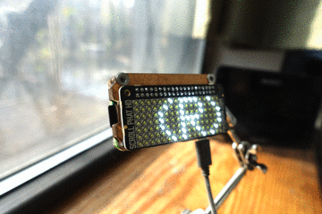

# mta-leavenow
A python script that let’s you know when it’s time to leave home to make the next subway train. The script reads the NYC MTA data feed to determine the next arrival train for a given station. There are two modes that the script will operate in:
* **leavenow** mode, letting you know when it's time to leave your home; or
* **traintime** mode that simply displays the arrival times of the next two trains.

In both case, travel time to your local station is taken into account and trains that you’ll never be able make are filtered out.

The script is based on Google’s GTFS Reatime format, it could quite easily be modifeid to work with other transport systems that also utilize the GTFS REaltime format https://developers.google.com/transit/gtfs-realtime/

# Output
Output is the console but its intent is to output to some sort of display. I have it running on a Raspberry Pi Zero W with a [Scroll pHAT HD](https://shop.pimoroni.com/products/scroll-phat-hd). I've then mounted it on a wall next to the door so I can glance at it just before I leave the apartment.



Typical output in **leavenow** mode:
```Leave home in 5 min for (D) train.```

Typical output in **traintime** mode:
```The (D) train departs in 8 min then (N) train departs in 11 min.```

# Prerequisites
The following packages are needed:  Google's [gtfs-realtime-bindings](https://github.com/google/gtfs-realtime-bindings) and Ben Hodgson's [protobuf-to-dict](https://github.com/kaporzhu/protobuf-to-dict). Depending on your system, you can install them with something like:
```
pip install --upgrade gtfs-realtime-bindings
pip install --upgrade protobuf-to-dict
```

You’ll also need an API key that you can register for here: http://datamine.mta.info/user/register and any libraries for the display you're using.

Finally you’ll need to know the IDs for both the train lines, and the subway station that you want to monitor. The script supports multiple feed IDs in case multiple lines cover a the station in question. For more information see: http://datamine.mta.info/list-of-feeds

# Installation and Configuration

With git installed, you can do the following to get it on your system. I personally prefer to put everything into ***/usr/local/src*** but sitting in your home directory will do.
```
git clone https://github.com/rob718/mta-leavenow.git
```
Once installed, you’ll need to edit the script to add things like an API key, feed IDs, and some other stuff.
```
cd mta-leavenow
nano mta-leavenow.py
```
**API key** - Update the API key your key that you registered for here: http://datamine.mta.info/user/register

**Subway Station ID** - The station you want to monitor. For example 'R31N' will monitor north-bound trains at Atlantic-Barclays Center.

**Station Travel Time** - Specify the amount of time (in seconds) it takes to walk to your local stop. This makes sure that only trains you can actually make will be shown.

**Subway Feed ID** - Specify the feed ID from the list of feeds here http://datamine.mta.info/list-of-feeds. For example 16 is the R, N, W, Q line. If you want to monitor multiple lines, comma separate them e.g. ```[16,21]```.

**Refresh Delay** - Specify the refresh feed time. Feeds are generated every 30 seconds, so anything less wouldn't make sense.

**Max Attempts** - If we’re unable to connect and/or process the feed, how many attempts before giving up (default is 30).

**Which mode?** - Don't forget to uncomment either of the last two lines of the script to switch the behavior of the program between the original **leavenow** mode letting you know when it's time to leave your home/office, or the **traintime** mode that simply displays the arrival times of the next two trains:
```
#if __name__ == '__main__': leavenow()
if __name__ == '__main__': traintime()
```

# Data Usage
The size of each feed is going to be anything from 50 to 120 kiBs depending on the line. It doesn't sound much, but with a delay of 30 seconds, for two lines (feeds), expect to pull around 450 MiB in a 24 hour period. Be warned!

# Execution
If you’re looking to run the script on boot, the simplest way would be to put it in the ***rc.local*** file. For example:
```
/usr/bin/python /usr/local/src/mta-leavenow/mta-leavenow.py &
```
However while testing it, I prefered to run it under screen, pressing ***CTRL-A***, then ***D*** to detach the current screen and logout. When I wanted to check progress, I simply entered ***screen -r*** to resume. For more information about screen, see: https://www.gnu.org/software/screen/manual/screen.html.
```
screen
cd mta-leavenow
python ./mta-leavenow.py
```

# Background
I don’t know about you, but I always run down those subway steps thinking I’ll miss the train if I don’t. One day I’m gunna fall. Seriously. How about a Raspberry Pi Zero connected to a set of LEDs counting down to the next subway train? Better yet, how about a scrolling display telling you when it’s time to leave home? Yes, that’s what I thought! I built this script to provide me (and maybe you!) stress-free travel to the local MTA station.

# Acknowledgments
Based on a concept written by Anthony N http://github.com/neoterix/nyc-mta-arrival-notify
